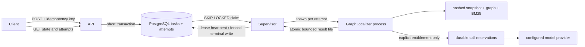
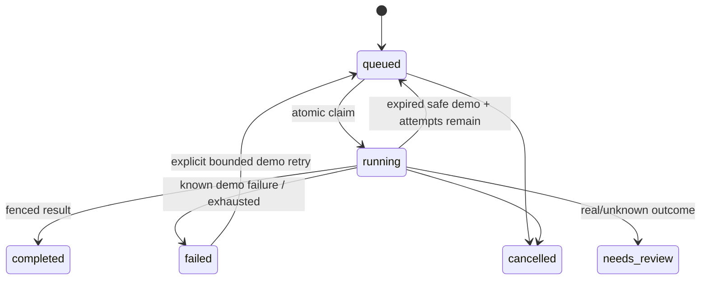

# Local task service architecture

## Ownership

API validates and persists requests; it never imports/runs the graph engine.
PostgreSQL owns durable state and attempt history. A supervisor owns a lease, not
permanent authority. Every terminal write and heartbeat first acquires the row
lock, then checks database wall-clock expiry and the complete claim identity.
The child process exclusively owns legacy graph globals for one attempt.

Child results are at most 16 MiB and published atomically only after complete
JSON serialization and fsync. Partial writes cannot block supervision.
The supervisor terminates/reaps the child when cancelled, expired, stopped or
unable to maintain storage connectivity. Linux parent-death handling prevents
orphaned real-provider calls from continuing after supervisor SIGKILL.

## States and recovery

Completed localization still distinguishes success, empty and iteration_limit.
The cancelled transition does not imply a provider request was never billed.
There is no automatic replay path from needs_review. v1 interrupted work has
unknown outcome and is quarantined during the explicit migration.

## Fixed sources and evaluation

Preparation uses an immutable Git archive, builds local graph/BM25 indexes, and
hashes all artifacts plus engine code. The manifest is addressed by its hash.
The scorer's patch-derived answers are separate and never sent to the provider.
Plans predeclare samples, paired arms, denominator, options and budget.
Fixture results intentionally leave real quality/token/cost fields null.
Only completed results contribute scores. Missing, corrupt, invalid or abnormally
terminated child records become failures; raw child bytes are retained separately.
The fixed denominator and billing ledger survive these failures; an uncertain live
attempt stops future calls but still produces a summary.

A paid request is reserved and fsynced before network I/O. Unknown calls halt the
experiment and keep their entire reservation. Completed responses are recorded
before model-output parsing. Reported tokens from failed attempts still count.
Provider aliases and peak price snapshots are provenance, not immutable remote
weights or invoice guarantees. The 65,536 input threshold is a local UTF-8 byte
estimate plus a 4,096 framing allowance, not a provider-enforced token cap.
The v2 pilot reserves the full 1,048,576-token context plus 512 output tokens for
every call, independent of that heuristic: CNY 3.151872 each / 18.911232 for six.
A fresh account-pricing confirmation is bound to the plan hash and checked before
any live output/ledger is created and before every provider call. Three calls per
arm are enforced durably. A separate stable lock serializes atomic ledger replacement;
file and directory fsync precede network I/O. No reservation is refunded.
Legacy v1 plans are offline-only. CLI --live enables only the current process after
explicit env-file loading; it never rewrites the file. SDK caller overrides are
filtered. The approved real pilot completed six calls after pricing confirmation;
its one-time approval and full reservations remain consumed.
Public constraints/rates and account assumptions must hold for the reservation math;
local bookkeeping is not a provider-side account spending cap.

## Operational scope

Local, single-trust-domain service. No authentication, multi-tenancy, automatic
data deletion or public deployment. PostgreSQL fencing protects database writes;
it cannot provide exactly-once remote billing. Worker processes isolate global
state; they are not an arbitrary-code sandbox. Trusted pickle indexes are accepted
only from the operator's hashed registry.

Compose keeps PostgreSQL and worker on an internal network; only API also joins
the ingress bridge and publishes 127.0.0.1:18080. Local-demo PostgreSQL uses trust
authentication on this isolated network, without creating credentials or exposing
a host database port. This profile is not a public/production deployment.

## First-pilot approval boundary

One project-fixed O_EXCL marker consumes the initial CNY 20 approval exactly once,
before creating a run ledger. It is bound to the approved plan hash, confirmation
hash, ledger absolute path and ownership token. Every call verifies this binding.
Different output directories, copied ledgers and refreshed confirmations cannot
mint another budget. Interrupted markers remain consumed; there is no automatic
reset/reclaim command. This is a single local approval, not one approval per run.
The CLI validates the actual pricing file and approved plan before env-file loading;
missing, malformed, stale or mismatched confirmations cannot trigger that loader.

Ledger initialization and provider construction resolve and pin the canonical absolute
path. Authorization, locking, reads and atomic replacement use this same path, including
when the input is a relative path or symlink. Input aliases are never replaced by saves.

The explicit zero-use recovery entry point permits one audited migration only for the
exact approved predecessor ledger with zero calls and zero reservation. It preserves
the prior marker/ledger in an audit record and binds the replacement plan and ledger.
Known or unknown calls, mismatched provenance and interrupted audit persistence fail
closed. This migration was used once for the local input-gate failure; it does not
authorize replay of the subsequently completed six-call pilot.
