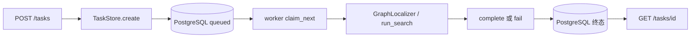

# 第二阶段：异步任务闭环演示

固定 fixture + fake provider 驱动第一阶段真实定位循环。FastAPI 接收请求并将任务
写入真正的 PostgreSQL；独立 Python worker 领取任务、运行 GraphLocalizer，
再把终态结果或错误写回数据库。HTTP 请求不会等候定位结束。

## 在现有 WSL 环境演示

```sh
cd ~/projects/LocAgent
# 已安装；新环境仅在原引擎虚拟环境基础上补这些常规依赖。
.venv/bin/python -m pip --isolated install --index-url https://pypi.org/simple -r requirements-service.txt
docker pull postgres:16-bookworm
.venv/bin/python -B -m locagent_service.demo up
.venv/bin/python -B -m locagent_service.demo run
```

浏览器打开 `http://127.0.0.1:8000/docs`，或使用 curl：

```sh
curl --noproxy '*' -i http://127.0.0.1:8000/tasks \
  -H 'Content-Type: application/json' \
  -d '{"source_id":"demo-v1","problem_statement":"Locate the render function.","options":{"max_iterations":6,"suppress_repeats":true}}'
# 使用上一步返回的 UUID；也可以直接查询响应 Location 的路径。
curl --noproxy '*' http://127.0.0.1:8000/tasks/<UUID>
```

POST 返回 **202**、任务 UUID 和 `Location: /tasks/<UUID>`。worker 尚未领取时为
`queued`，领取后为 `running`。成功演示的终态为 `completed`，
`result.status=success`、`found_files=["demo.py"]`、
`found_entities=["demo.py:render"]`、`iterations=3`。
两次真实工具调用共享 return_trace；第二条账本标记 repeated，保留完整原文，
发送给下一轮 fake provider 的工具消息则已缩短。

演示其它分支：

```sh
.venv/bin/python -B -m locagent_service.demo run --scenario provider_error
.venv/bin/python -B -m locagent_service.demo run --scenario empty
.venv/bin/python -B -m locagent_service.demo run --scenario iteration_limit
.venv/bin/python -B -m locagent_service.demo status
```

`demo_scenario` 是显式的演示选择，不是问题文本推断的定位质量。
fake provider 的 token 数也是确定的测试值，不是费用记录。

## 服务、数据和停止

| 项目 | 配置 |
| --- | --- |
| API | 仅 `127.0.0.1:8000`，独立 Uvicorn 进程 |
| worker | 独立 Python 进程，一个进程一次运行一个任务 |
| PostgreSQL | 官方 `postgres:16-bookworm`；本机 `127.0.0.1:55432` |
| 容器 / 数据卷 | `locagent-stage2-pg` / `locagent-stage2-pg-data` |
| 数据库 / schema | `locagent_demo` / `locagent` |
| 本机运行文件 | `outputs/stage2/demo/runtime.json`、`api.log`、`worker.log` |

首次启动仅为本演示生成随机数据库密码，runtime 文件权限为 0600，且 outputs
已被 Git 忽略；不读取或改动用户现有凭证。不要分享 runtime 文件或将它提交。
容器和数据卷具有本演示所有权标签，工具遇到同名但无标签的资源会拒绝接管。
PID 连同启动时间、命令和工作目录一起核对，停止工具只处理本演示的进程。

```sh
.venv/bin/python -B -m locagent_service.demo down
# 再启动不会删除历史任务或生成新的数据库凭证。
.venv/bin/python -B -m locagent_service.demo up
```

down 先发 SIGTERM 停止 worker/API，再停止 PostgreSQL 容器；**保留数据卷**。
worker 正常收到停止信号后完成当前任务再退出，没有任务级硬截止。
进程/数据库启动失败时查看对应日志；不要通过删卷解决未知问题。
Docker 不可用、端口被占用或缺少镜像均会明确失败，不回退到 SQLite。

手动分开启动时，由操作者设置 `LOCAGENT_DATABASE_URL` 为 PostgreSQL URL，
可选 `LOCAGENT_SCHEMA`；然后分别运行：

```sh
.venv/bin/python -B -m locagent_service.db
.venv/bin/python -B -m locagent_service.api --port 8000
# 另一个终端，同一数据库配置：
.venv/bin/python -B -m locagent_service.worker
# --once 只领取最多一个任务，适合观察闭环。
```

## 自顶向下阅读



1. `locagent_service/api.py:create_app` 与 `models.py:CreateTask/TaskView`：先看 HTTP
   输入、202 确认和查询结果；API 不导入图引擎或模型客户端。
2. `locagent_service/store.py:create/claim_next/_finish` 与
   `migrations/001_tasks.sql`：观察参数化 SQL、事务提交、任务状态与 JSONB 约束。
3. `locagent_service/worker.py:run_one`：领取事务关闭后才调用引擎，再单独持久化终态。
4. `locagent_service/fixture.py:localize_demo` → `util/localizer.py:localize` →
   `util/localization_engine.py:run_search`：沿调用链回到已有真实工具循环。

## 状态、错误和领取边界

| 任务状态 | 数据含义 |
| --- | --- |
| queued | 未领取；result/error/worker/执行时间为空 |
| running | 已持久化领取身份、claim token 和开始时间；result/error 仍为空 |
| completed | 引擎正常返回，result 非空，error 为空，完成时间非空 |
| failed | 引擎或请求校验错误，error 非空，result 为空，完成时间非空 |

`completed` 的定位结果仍分 `success` / `empty` / `iteration_limit`。
因此 completed 只代表本次引擎执行返回，不能据此宣称定位成功。
错误结构为 `{"code":"model_error","message":"Provider request failed"}` 等第一阶段
公共错误。HTTP 校验错误为 422 `invalid_request`，不存在的任务为 404 `not_found`，
存储不可用为 503 `database_unavailable`。不回显 provider/数据库异常原文。

领取使用一条 CTE + `FOR UPDATE SKIP LOCKED` + UPDATE，在短事务中把 queued 改为
running 并提交。定位期间无数据库事务或行锁。终态 UPDATE 同时检查 task ID、
running 状态、worker ID 和 claim token，拒绝重复/错误领取者覆盖终态。
数据库 CHECK 约束检查状态与 payload/时间字段的一致性，并显式拒绝 NULL 结果状态。
初始化是串行保护的、可重复的 v1 加法初始化，不清表；没有自动升级任意未来 schema。

## 验收命令和证据

```sh
# 不需要 PostgreSQL：原有 48 项 + 本阶段 13 项纯单元/HTTP/fixture 用例。
LITELLM_LOCAL_MODEL_COST_MAP=True HF_HUB_OFFLINE=1 HF_DATASETS_OFFLINE=1 \
  .venv/bin/python -B -m unittest discover -s tests -p 'test_*.py' -v
# 需要真正的 PostgreSQL；不可用则失败，不跳过或使用 mock。
.venv/bin/python -B -m locagent_service.demo db
.venv/bin/python -B tests/run_stage2_acceptance.py
.venv/bin/python -B tests/run_historical_smokes.py
git diff --check
```

PostgreSQL 验收的 13 项测试包括六个并发领取者、跳过已锁队首、owner/token 检查、
终态一致性、真实 HTTP 入库、独立 worker、两个独立 worker 的不同领取、API 重启
持久化、错误/空结果/迭代上限，以及杀死 worker 后的 running 残留。
每个测试只建立/删除自己的 `acceptance_<随机UUID>` schema，保留 demo 数据。
API/worker 子进程日志在 `outputs/stage2/acceptance/`，全套人工演示记录在
`outputs/stage2/demo/last_demo.json`。纯 HTTP 单元测试有 FakeStore，不能代替上述验收。
引擎执行作用域阻断 Python 网络和真实 completion，PostgreSQL/HTTP 验收只允许本机。
这不是针对任意 Python/native 扩展的 OS 沙箱。

2026-10-06 实际验收：Ubuntu WSL、Python 3.12.3、PostgreSQL 16.15；
61 项纯测试通过，13 项真实数据库/进程测试通过。完整演示已从 HTTP 提交成功、
失败、空结果和迭代上限四种任务，并停启 PostgreSQL 容器、API 和 worker 后逐一
查询到完全相同的历史结果；新 worker 又完成一个新任务。
成功演示任务 ID：`b28926a7-3073-4a23-bbc7-c4eae7b95fe8`；
重启后新任务 ID：`67fd05e2-f235-4d49-939f-67b1e4b42b24`。
最终回归：61 项纯测试（8.900 秒）、13 项 PostgreSQL/进程验收（38.318 秒）、
Day4–6 三份历史 smoke 均通过；Day6 继续复现第二次工具消息 2493 → 259 字符。
`pip check` 无依赖冲突，13 个第二阶段 Python 文件 compile 通过，新增文件空白及
`git diff --check` 通过。第一阶段代码和测试与 HEAD 字节一致。
Windows 的 `127.0.0.1:8000/health` 已返回 200，OpenAPI 三条路径可读取。

## 文件清单

修改两份说明、新增十六个文件；没有暂存、提交或推送。
分支为 `work/locagent-baseline`，HEAD 为
`1d1e0bf3a9c0a48d1fd280e5707c7ff56000cab8`。

```text
README.md
tests/README.md
STAGE2_ACCEPTANCE.md
requirements-service.txt
locagent_service/__init__.py
locagent_service/api.py
locagent_service/config.py
locagent_service/db.py
locagent_service/demo.py
locagent_service/fixture.py
locagent_service/models.py
locagent_service/offline.py
locagent_service/store.py
locagent_service/worker.py
locagent_service/migrations/001_tasks.sql
tests/test_stage2_service.py
tests/stage2_postgres_acceptance.py
tests/run_stage2_acceptance.py
```

## 明确限制

- 仅本机受控演示；没有认证、多租户或公网部署。HTTP 不接受 repo、base_commit、
  模型、索引路径、上传 pickle 或任意仓库 clone。来源只允许固定 demo-v1。
- 阶段二不做租约、心跳、自动重试或崩溃恢复。worker 被 kill 或终态写盘前数据库
  失败时，任务会留在 running；新 worker 不会重新领取它。本次测试明确验证此限制。
  保留旧记录并新提交任务即可继续演示，不能声称 exactly-once 完成。
- POST 没有幂等键；客户端重复提交会创建不同 UUID 的任务。没有配额、任务删除、
  重试 API、费用或模型质量评估。终态含完整消息和账本，无长期保留/清理策略。
- 多 worker 的领取和终态保护已验证；并不等同于全生命周期并发或故障安全。
  独立进程隔离旧图工具全局状态，但 worker 不是任意代码的安全沙箱。
- 没有整个定位任务的硬超时。真实模型、任意真实仓库索引、完整 benchmark 未验证。

实现参考：[PostgreSQL 行锁及 SKIP LOCKED](https://www.postgresql.org/docs/16/sql-select.html)、
[psycopg 事务边界](https://www.psycopg.org/psycopg3/docs/basic/transactions.html)、
[FastAPI 错误处理](https://fastapi.tiangolo.com/tutorial/handling-errors/)。
